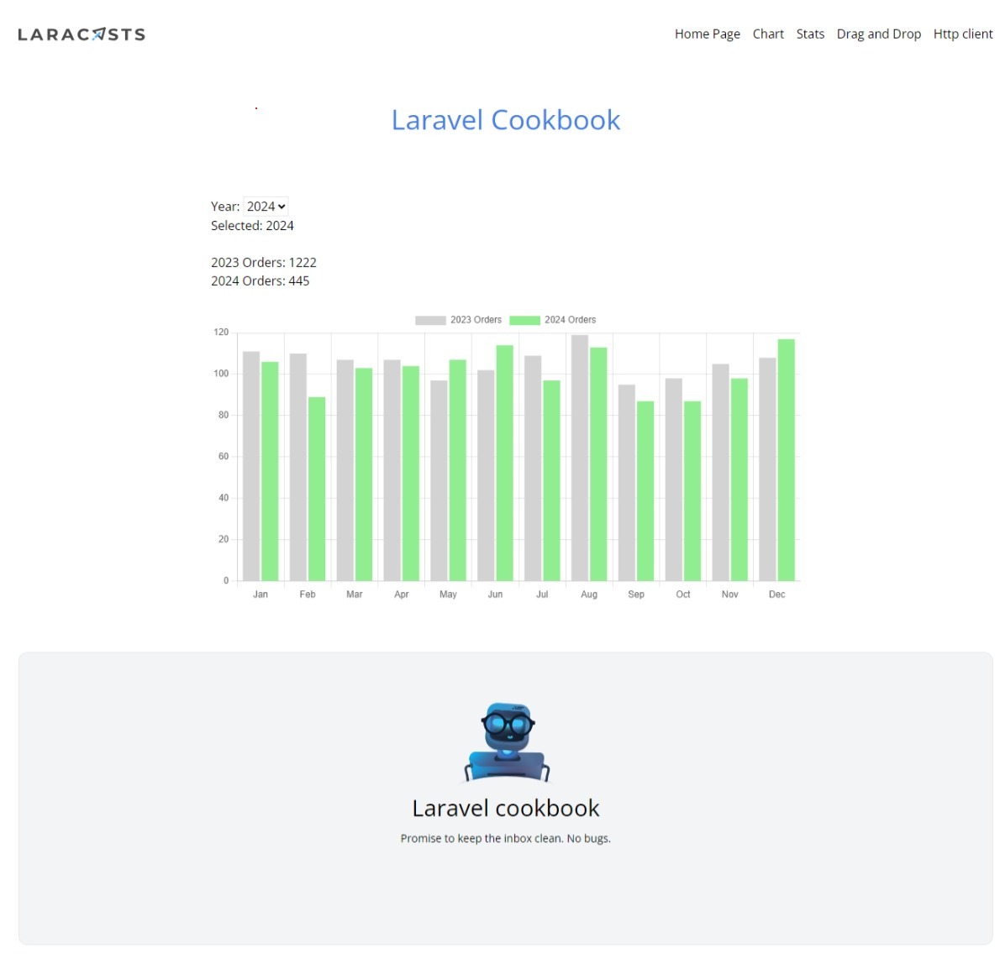
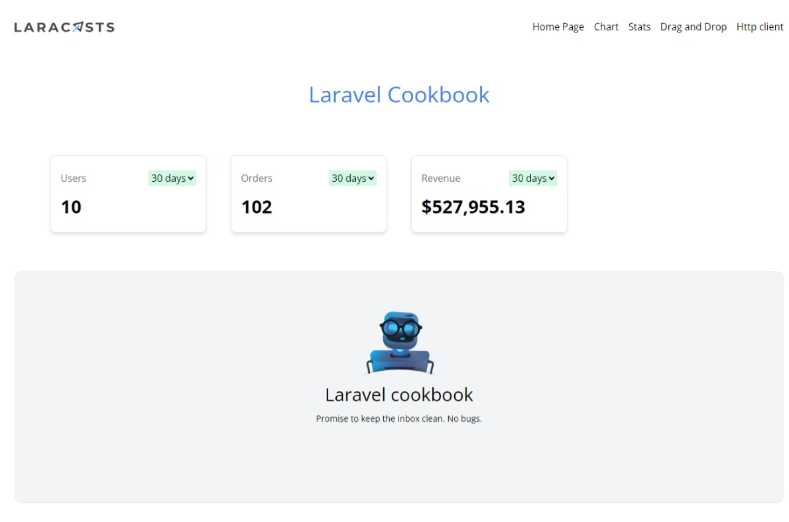
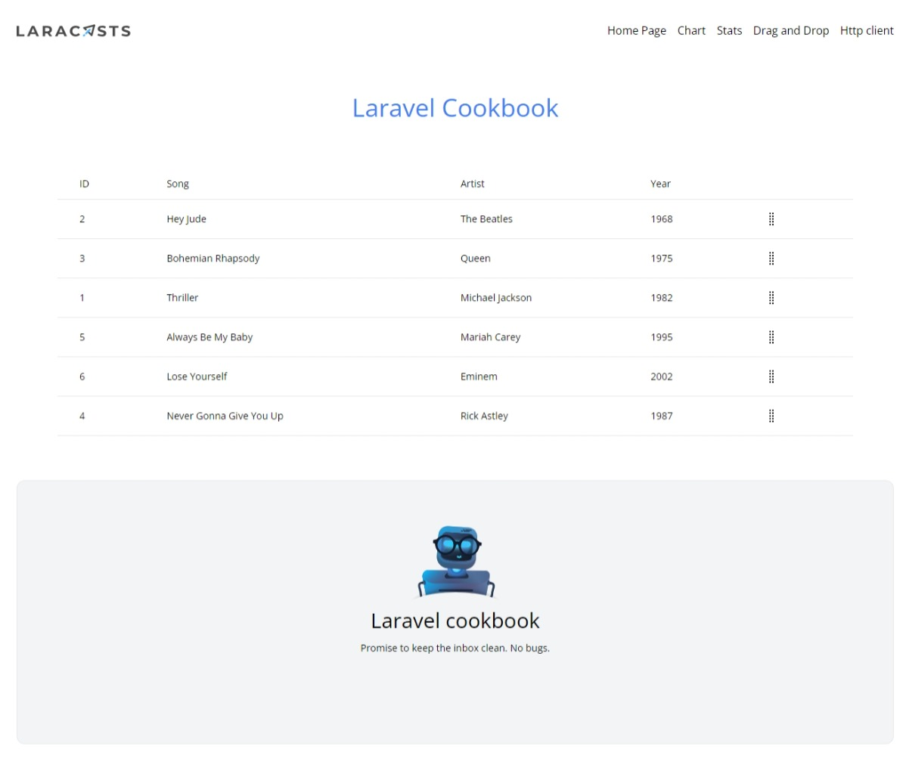
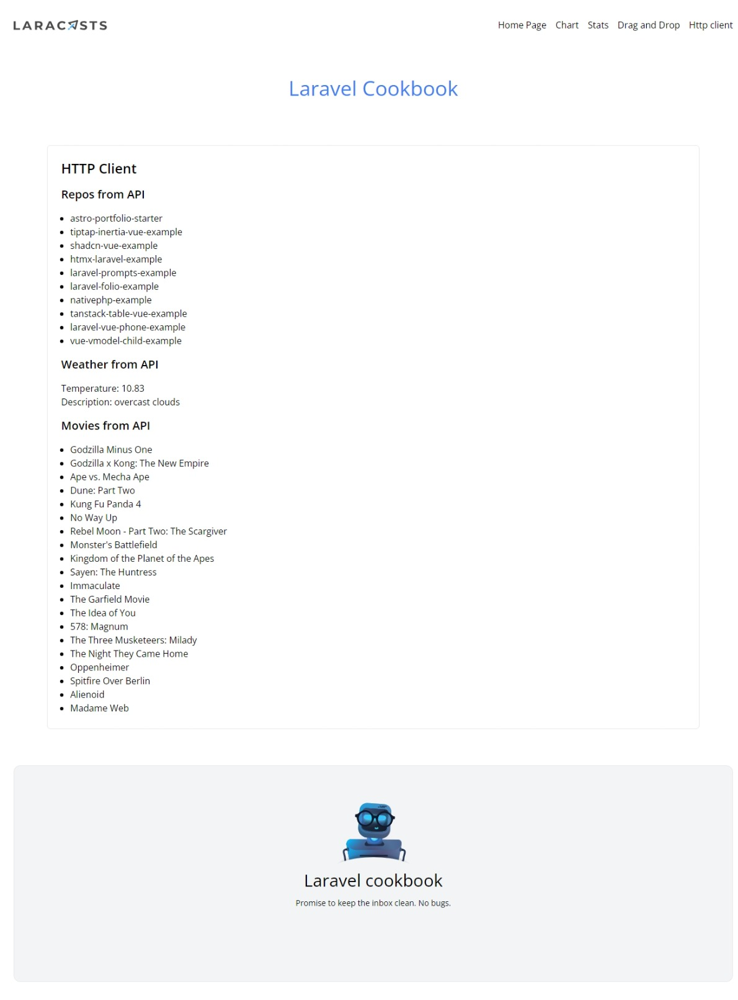

<h3>building practical features for typical Laravel web application . Charts, Stats  </h3>

Using laravel 10 , tailwind css ,livewire v3 ,alpine.js
  

we'll also leverage various JavaScript libraries whenever we require additional interactivity for a better user experience 
  
<h3>Charts page</h3>  

We used chart.js ,alpine.js ,laravel livewire v3
  
 
<h3>Stats page</h3>  
 
<h3>Drag and Drop songs list</h3>  

We used laravel-sortable.js Costom blade components to add sortable/drag-and-drop HTML elements in your app
  
 
<h3>Calling and displaying data from an APIs</h3>  

like github repos api , OpenWeather api , the Movie Database (TMDB) api
  
 

